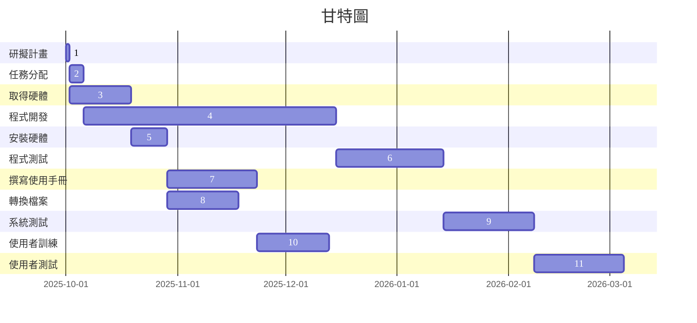

```mermaid
%%{init: {"themeVariables": {"fontFamily": "Noto Sans TC, Microsoft JhengHei, PingFang TC, sans-serif"}}}%%
gantt
    title 甘特圖
    dateFormat  YYYY-MM-DD
    section 研擬計畫
    1      :2025-10-01, 1d
    section 任務分配
    2      :2025-10-02  , 4d
    section 取得硬體
    3      :2025-10-02  , 17d
    section 程式開發
    4      :2025-10-06  , 70d
    section 安裝硬體
    5      :2025-10-19  , 10d
    section 程式測試
    6      :2025-12-15  , 30d 
    section 撰寫使用手冊
    7      :2025-10-29  , 25d
    section 轉換檔案
    8      :2025-10-29  , 20d
    section 系統測試
    9      :2026-01-14  , 25d
    section 使用者訓練
    10      :2025-11-23  , 20d
    section 使用者測試
    11      :2026-02-08  , 25d

```

